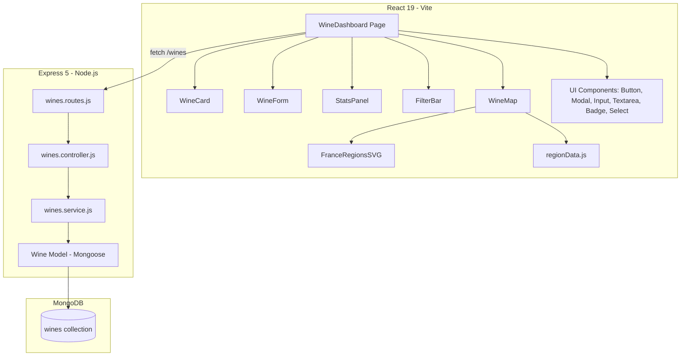
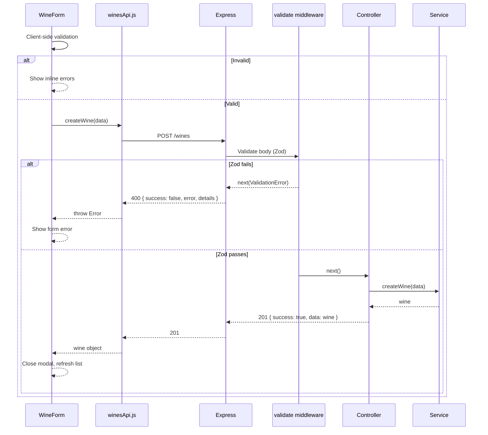

# Wine Cellar Management — Design Document

## Overview

This document describes the technical design for the wine cellar management application. It transforms the existing task management MERN app into a personal wine cellar inventory tool while preserving the established architecture, conventions, and UI component library.

The design covers the full stack: a RESTful Express API backed by MongoDB, and a React 19 single-page frontend. The app is single-user with no authentication.

### Design Principles

- **Preserve existing patterns** — follow the layered backend architecture (routes → controllers → services → models) and the component-based frontend with CSS Modules.
- **Replace, don't extend** — task-related code is removed and replaced with wine-related code. No dual-resource app.
- **Keep it simple** — no routing library on the frontend (single dashboard page), no state management library, direct fetch-based API calls.

---

## Architecture

### High-Level Diagram



### Backend Architecture

The backend follows the existing layered pattern:

| Layer | File | Responsibility |
|-------|------|---------------|
| Routes | `src/routes/wines.routes.js` | HTTP method + path mapping, validation middleware |
| Schema | `src/routes/wines.schema.js` | Zod schemas for request validation |
| Controller | `src/controllers/wines.controller.js` | Parse request, call service, send response |
| Service | `src/services/wines.service.js` | Business logic, DB queries via Mongoose |
| Model | `src/models/Wine.js` | Mongoose schema + indexes |

Existing infrastructure is kept unchanged:
- `src/app.js` — middleware stack (helmet, cors, json, pino-http, routes, 404, error handler)
- `src/middlewares/validate.js` — Zod-based validation middleware
- `src/middlewares/errorHandler.js` — centralized error handling
- `src/utils/errors.js` — custom error classes (AppError, NotFoundError, ValidationError)
- `src/utils/logger.js` — pino logger
- `src/config/` — environment config + DB connection

### Frontend Architecture

The frontend is a single-page app with one dashboard page:

| Layer | File(s) | Responsibility |
|-------|---------|---------------|
| Page | `client/src/pages/WineDashboard.jsx` | Orchestrates state, fetches data, renders layout |
| Feature components | `client/src/components/wines/` | WineCard, WineForm, FilterBar, StatsPanel, WineMap, FranceRegionsSVG, regionData |
| UI components | `client/src/components/ui/` | Button, Modal, Input, Textarea, Badge, Select (new) |
| API service | `client/src/services/winesApi.js` | Fetch wrapper for all wine endpoints |
| Styles | CSS Modules (`.module.css` per component) | Scoped styling using design system variables |

### Vite Proxy Configuration

```js
// vite.config.js — proxy update
proxy: {
  '/wines': { target: 'http://localhost:3000', changeOrigin: true },
  '/health': { target: 'http://localhost:3000', changeOrigin: true },
}
```

---

## Components and Interfaces

### Backend API Endpoints

All endpoints are mounted at `/wines`. Responses follow `{ success: boolean, data?: any, error?: string }`.

#### `GET /wines`

Returns all wines, with optional query filters.

| Query Param | Type | Description |
|-------------|------|-------------|
| `type` | string (enum) | Filter by wine type |
| `status` | string (enum) | Filter by status |
| `search` | string | Case-insensitive partial match on name or producer |

**Response:** `{ success: true, data: Wine[] }`

#### `GET /wines/:id`

Returns a single wine by ID.

**Response:** `{ success: true, data: Wine }` or 404.

#### `POST /wines`

Creates a new wine entry.

**Request body:** See Wine create schema below.  
**Response:** `201 { success: true, data: Wine }` or `400` with validation errors.

#### `PUT /wines/:id`

Updates an existing wine by ID.

**Request body:** See Wine update schema below (all fields optional).  
**Response:** `{ success: true, data: Wine }` or 400/404.

#### `DELETE /wines/:id`

Deletes a wine by ID.

**Response:** `{ success: true, data: null }` or 404.

---

### Backend: Zod Validation Schemas

```js
// wines.schema.js
const wineTypes = ['Red', 'White', 'Rosé', 'Sparkling', 'Dessert', 'Fortified'];
const wineStatuses = ['In Cellar', 'Consumed', 'Wishlist'];
const currentYear = new Date().getFullYear();

const createWineBody = z.object({
  name: z.string().min(1).max(200),
  producer: z.string().min(1).max(200),
  vintage: z.number().int().min(1900).max(currentYear + 1).optional(),
  type: z.enum(wineTypes),
  grape: z.string().max(200).optional(),
  region: z.string().max(200).optional(),
  country: z.string().max(100).optional(),
  quantity: z.number().int().min(0).default(1),
  price: z.number().min(0).optional(),
  rating: z.number().int().min(1).max(5).optional(),
  notes: z.string().max(2000).optional(),
  status: z.enum(wineStatuses).default('In Cellar'),
});

const updateWineBody = createWineBody.partial();

const getWinesQuery = z.object({
  type: z.enum(wineTypes).optional(),
  status: z.enum(wineStatuses).optional(),
  search: z.string().max(200).optional(),
});
```

---

### Frontend Components

#### `WineDashboard` (page)

The main page component. Manages:
- Wine list state (fetched from API)
- Filter/search state (local)
- Modal state (create/edit)
- Computed stats

**State:**
```js
const [wines, setWines] = useState([]);
const [loading, setLoading] = useState(true);
const [error, setError] = useState(null);
const [filters, setFilters] = useState({ type: '', status: '', search: '' });
const [selectedRegion, setSelectedRegion] = useState(null);
const [showCreateModal, setShowCreateModal] = useState(false);
const [editingWine, setEditingWine] = useState(null);
```

#### `FilterBar`

Renders filter controls: type dropdown, status dropdown, and text search input. Emits filter changes via `onFilterChange` callback.

**Props:**
```js
{ filters, onFilterChange }
// filters: { type: string, status: string, search: string }
```

#### `StatsPanel`

Displays summary statistics computed from the wine list.

**Props:**
```js
{ wines }
// Computes: totalBottles, cellarValue, breakdownByType
```

Displays:
- Total bottles in cellar (sum of quantities where status = "In Cellar")
- Estimated cellar value (sum of quantity × price where status = "In Cellar" and price is set)
- Breakdown by type (count per type for "In Cellar" wines)

#### `WineMap`

Displays an interactive SVG map of French wine regions with click-to-filter functionality.

**Props:**
```js
{ wines, selectedRegion, onRegionSelect }
// wines: full unfiltered wine list (used to determine which regions are active)
// selectedRegion: currently selected region key or null
// onRegionSelect: callback(regionKey | null) to toggle region filter
```

**Sub-components:**
- `FranceRegionsSVG` — SVG map rendered from real geographic boundary data (French départements GeoJSON). Each region is a clickable `<path>` with dynamic class names for active/selected states.
- `regionData.js` — Data module containing:
  - `FRENCH_WINE_REGIONS` — mapping of 14 major regions to their sub-regions/appellations
  - `findParentRegion(name)` — resolves a wine's region field to its parent region (case-insensitive)
  - `getRegionFilterValues(regionKey)` — returns all names (parent + sub-regions) for filtering
  - `getActiveRegions(wines)` — returns a Set of region keys with at least one wine

**Visual states:**
- Default (gray): no wines from this region
- Active (wine-red): at least one wine matches this region
- Selected (primary purple with shadow): currently filtering by this region

**Filtering logic:** Region filter is applied client-side in `WineDashboard` via a `useMemo` that filters the API-returned wines against the selected region's name list. This combines with server-side type/status/search filters (AND logic).

#### `WineCard`

Displays a single wine entry in a card layout.

**Props:**
```js
{ wine, onEdit, onDelete }
```

Shows: name, producer, vintage, type (as colored badge), quantity, rating (stars or number), status badge.

#### `WineForm`

Handles both create and edit in a modal. Pre-populated when editing. The modal is draggable by holding the mouse button on the header area.

**Props:**
```js
{ wine?, onSubmit, onCancel }
```

Uses `useTransition` for pending state during submission. Client-side validation mirrors the Zod schema rules. Fields:
- Name (text, required)
- Producer (text, required)
- Vintage (number, optional)
- Type (select, required)
- Grape variety (text, optional)
- Region (text, optional)
- Country (text, optional)
- Quantity (number, required, default 1)
- Price (number, optional)
- Rating (number 1-5, optional — rendered as clickable stars or select)
- Notes (textarea, optional)
- Status (select, required, default "In Cellar")

#### `Select` (new UI component)

A styled select input consistent with the existing `Input` component.

**Props:**
```js
{ label, error, id, options, placeholder, ...props }
// options: Array<{ value: string, label: string }>
```

---

### Frontend API Service

```js
// client/src/services/winesApi.js
const API_BASE = '/wines';

export async function fetchWines(filters = {}) { /* GET /wines?type=&status=&search= */ }
export async function fetchWineById(id) { /* GET /wines/:id */ }
export async function createWine(data) { /* POST /wines */ }
export async function updateWine(id, data) { /* PUT /wines/:id */ }
export async function deleteWine(id) { /* DELETE /wines/:id */ }
```

Each function:
1. Builds the URL (with query params for `fetchWines`)
2. Calls `fetch` with appropriate method/headers/body
3. Checks `res.ok`, extracts JSON
4. Returns `json.data` on success, or throws an Error with the server error message

---

## Data Models

### MongoDB Schema — `Wine`

```js
// src/models/Wine.js
const wineSchema = new mongoose.Schema(
  {
    name: { type: String, required: true, trim: true, maxlength: 200 },
    producer: { type: String, required: true, trim: true, maxlength: 200 },
    vintage: { type: Number, min: 1900, max: currentYear + 1 },
    type: {
      type: String,
      required: true,
      enum: ['Red', 'White', 'Rosé', 'Sparkling', 'Dessert', 'Fortified'],
    },
    grape: { type: String, trim: true, maxlength: 200, default: '' },
    region: { type: String, trim: true, maxlength: 200, default: '' },
    country: { type: String, trim: true, maxlength: 100, default: '' },
    quantity: { type: Number, required: true, min: 0, default: 1 },
    price: { type: Number, min: 0 },
    rating: { type: Number, min: 1, max: 5 },
    notes: { type: String, trim: true, maxlength: 2000, default: '' },
    status: {
      type: String,
      required: true,
      enum: ['In Cellar', 'Consumed', 'Wishlist'],
      default: 'In Cellar',
    },
  },
  { timestamps: true }
);

// Indexes for common query patterns
wineSchema.index({ type: 1 });
wineSchema.index({ status: 1 });
wineSchema.index({ name: 'text', producer: 'text' });
```

### Index Strategy

| Index | Purpose |
|-------|---------|
| `{ type: 1 }` | Fast filtering by wine type |
| `{ status: 1 }` | Fast filtering by status |
| `{ name: 'text', producer: 'text' }` | Text search across name and producer |

The text index supports the `search` query parameter via MongoDB's `$text` operator. For partial/prefix matching (better UX with short inputs), the service layer will use regex as a fallback when the search term is under 3 characters.

### Seed Data

A new seed script (`scripts/seed.js`) will be updated to insert sample wines instead of tasks. A `wines.json` seed file will replace the `taks` file.

---

## Error Handling

### Backend Errors

The existing error infrastructure is reused without modification:

| Error Class | Status | When |
|-------------|--------|------|
| `ValidationError` | 400 | Zod schema validation fails (via `validate` middleware) |
| `NotFoundError` | 404 | Wine ID not found in database |
| `AppError` | 500 | Unexpected server errors |

The centralized `errorHandler` middleware formats all errors consistently:
```json
{ "success": false, "error": "message", "details": [...] }
```

### Frontend Error Handling

- **Network/API errors**: caught in `winesApi.js`, thrown as `Error` with server message. Displayed as an error banner in the dashboard with a "Retry" button.
- **Form validation errors**: caught by `WineForm` client-side validation before submission. Displayed inline per field.
- **Submission errors**: caught in the `useTransition` callback, displayed as a form-level error alert.
- **Loading states**: a loading spinner/message shown while fetching data.
- **Empty state**: a friendly message when no wines exist or no results match the current filters.

### Error Flow



---

## Testing Strategy

### Backend Tests

**Framework:** Jest + Supertest (integration tests against the Express app with a test MongoDB instance).

#### Unit Tests (Services)

| Test | Description |
|------|-------------|
| `wines.service.test.js` | Test getAllWines with various filters, getWineById (found/not found), createWine, updateWine (found/not found), deleteWine (found/not found) |

Mock the Mongoose model to isolate service logic.

#### Integration Tests (Routes)

| Test | Description |
|------|-------------|
| `GET /wines` | Returns all wines; filters by type, status, search; returns empty array when no matches |
| `GET /wines/:id` | Returns wine by ID; returns 404 for invalid/missing ID |
| `POST /wines` | Creates wine with valid data (201); rejects invalid data (400); validates required fields |
| `PUT /wines/:id` | Updates wine (200); partial update works; rejects invalid data (400); returns 404 for missing ID |
| `DELETE /wines/:id` | Deletes wine (200); returns 404 for missing ID |

Use an in-memory MongoDB (e.g., `mongodb-memory-server`) for test isolation.

### Frontend Tests

**Framework:** Vitest + React Testing Library.

#### Component Tests

| Component | Tests |
|-----------|-------|
| `WineCard` | Renders wine info correctly; calls onEdit/onDelete; displays badges for type and status |
| `WineForm` | Shows validation errors for required fields; submits valid data; pre-populates in edit mode; calls onCancel |
| `FilterBar` | Updates filters on change; clears filters |
| `StatsPanel` | Computes correct totals; handles empty list |
| `Select` | Renders options; shows error state; accessible labels |

#### Integration Tests (Page)

| Test | Description |
|------|-------------|
| `WineDashboard` | Fetches and displays wines on mount; handles loading/error/empty states; create flow (open modal → fill form → submit → appears in list); edit flow; delete flow with confirmation; filter application |

Mock `fetch` via MSW or manual mocking to control API responses.

### Test Commands

```bash
# Backend tests
npm test                    # Jest (to be configured)

# Frontend tests  
cd client && npm test       # Vitest (to be configured)
```

### Test Coverage Targets

- Backend services/routes: ≥ 90% line coverage
- Frontend components: ≥ 80% line coverage
- Critical paths (CRUD operations, validation): 100% covered

---

## Summary of Changes from Task App

| Area | Remove | Add |
|------|--------|-----|
| Model | `src/models/Task.js` | `src/models/Wine.js` |
| Routes | `src/routes/tasks.routes.js`, `tasks.schema.js` | `src/routes/wines.routes.js`, `wines.schema.js` |
| Controller | `src/controllers/tasks.controller.js` | `src/controllers/wines.controller.js` |
| Service | `src/services/tasks.service.js` | `src/services/wines.service.js` |
| Route index | `/tasks` mount | `/wines` mount |
| Config | `mongoUri: .../tasks-mern` | `mongoUri: .../wine-cellar` |
| Seed | `scripts/seed.js` + `taks` | `scripts/seed.js` + `wines.json` |
| Vite proxy | `/tasks` | `/wines` |
| Frontend page | `TaskDashboard.jsx` | `WineDashboard.jsx` |
| Frontend components | `components/tasks/` | `components/wines/` |
| Frontend API | `services/tasksApi.js` | `services/winesApi.js` |
| New UI component | — | `components/ui/Select.jsx` |
